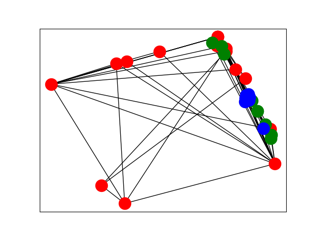
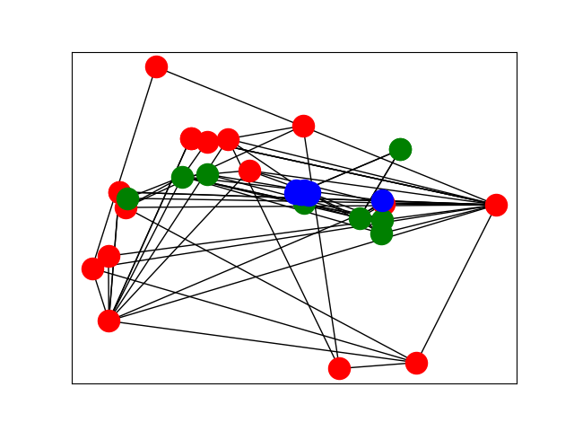
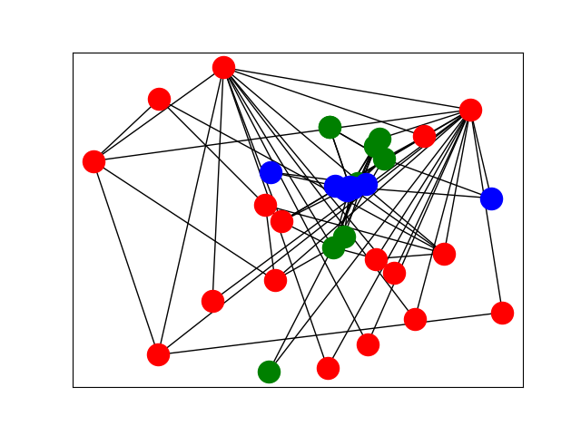
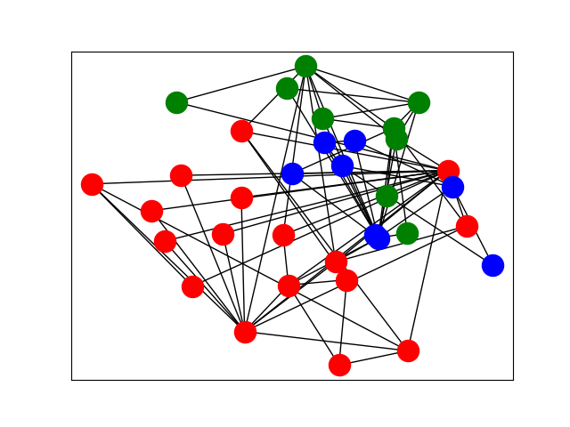
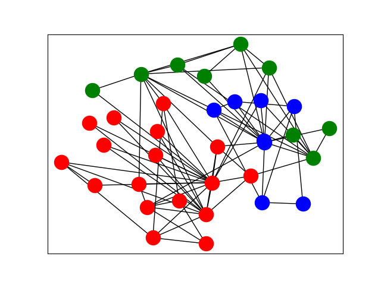
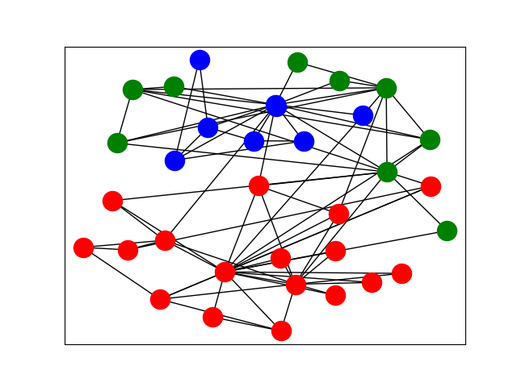
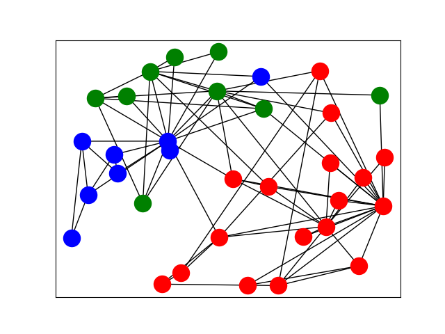

# Robustness
According to our experiments, the robustness of the Molecular Dynamics embeddings 
depend heavily on the initial positions of the nodes. To get around this issue, we
propose running the algorithm several times. There are several ways to achieve this.
We tried the following general approach:
- Create multiple embeddings using random initializations
- Apply MDS to reduce the dimensions to the original size

## Ensemble Methods
There are various methods of applying ensemble learning for Molecular Communities. 
We tried the following methods:
- Naive ensembles
  - Learn from an ensemble of $n$ embeddings
- Greedy ensemble
  - Skim the top $k$ embeddings with minimum energy from a total of $n$
- Cumulative ensemble
  - Use the cumulative MDS embedding for the next iteration

### Greedy ensembles
#### Karate Club Data

2 dims

4 dims

8 dims

16 dims

32 dims

64 dims

128 dims
